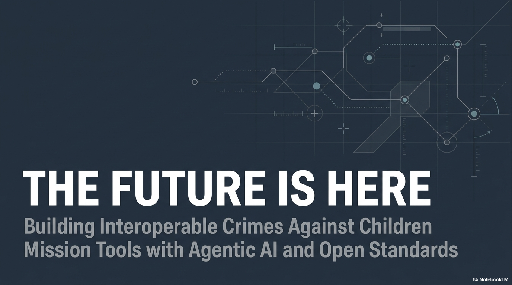
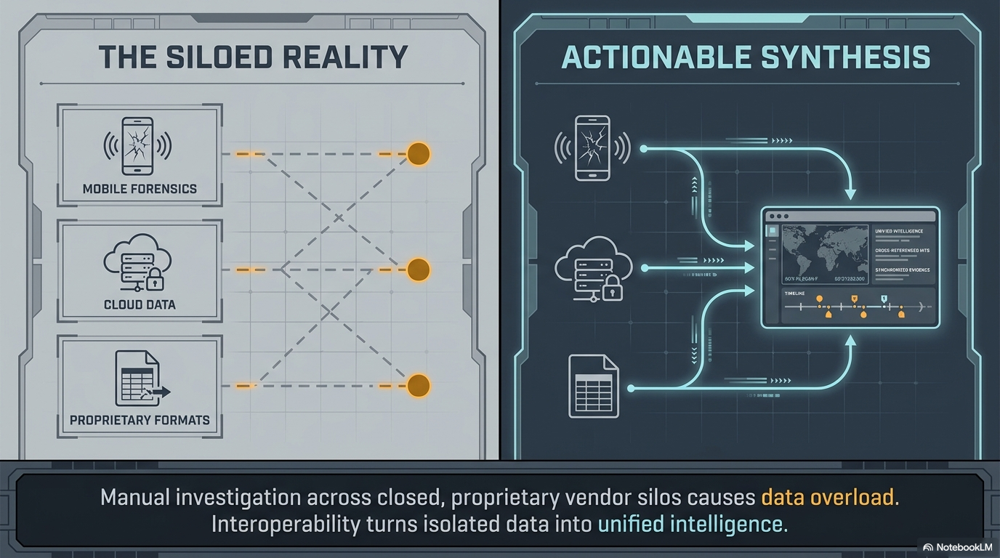
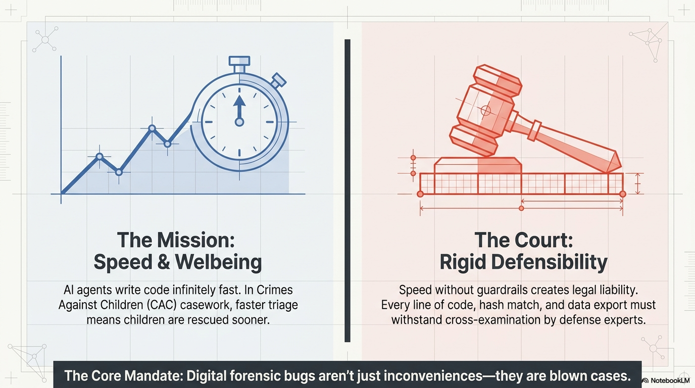

# Welcome & Why This Matters

---

## Instructor Visual: Course Frame

---

## The Challenge

- CyberTip volume is growing exponentially
- Devices per case: phones, tablets, laptops, cloud accounts, gaming consoles, IoT
- More platforms, more data, more complexity — same-sized teams
- The tools you need don't exist yet, or they don't talk to each other

---

## The Daily Reality

- Hours spent reformatting data between tools
- Manual re-entry from forensic reports into case management
- Investigation context trapped in spreadsheets, emails, and your head
- Building the evidence narrative by hand, every single time

---

## Instructor Visual: The Siloed Reality

---

## Instructor Visual: Speed and Defensibility

---

## What If You Could Change That?

- Build the exact tool your mission needs
- Make it interoperable with every other tool from day one
- Do it without being a software developer
- Do it in hours, not months

---

## Today's Promise

By the end of this lecture and the lab that follows, you will:

1. Understand what agentic AI is and how it works
2. Know how to find and build on existing open-source tools
3. Understand the open standards that make tools interoperable
4. See a working mission tool built from scratch with AI — live

---

## Instructor Visual: Full Course Map

---

## You Do NOT Need to Be a Programmer

If you can describe what you need in plain language, you can build it.

That's the paradigm shift we're here to show you.
