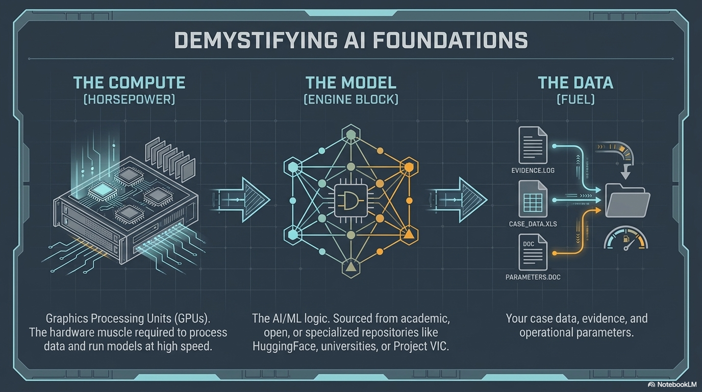

# AI Foundations

---

## What Is Artificial Intelligence?

Software that can perform tasks that typically require human intelligence:

- Recognizing patterns in data
- Making predictions
- Understanding and generating human language
- Reasoning through problems

AI is a **tool**, not magic. Understanding it helps you use it effectively.

---

## Instructor Visual: Compute, Model, Data

---

## What Is a Large Language Model (LLM)?

A program trained on enormous amounts of text that can understand and generate human language.

**Examples you may know:**
- ChatGPT (OpenAI)
- Claude (Anthropic)
- Gemini (Google)
- Copilot (Microsoft / GitHub)

---

## Not All LLMs Are the Same

There are different types of LLMs, each designed for different strengths:

| Type | What It Does | When You'd Use It |
|------|-------------|-------------------|
| **Instruction-Following** | Follows directions precisely. You say "do X," it does X. | Writing reports, formatting data, building tools |
| **Reasoning** | Thinks step-by-step through complex problems. Takes longer but gets harder things right. | Analyzing evidence connections, legal reasoning, planning |
| **Dense Models** | Every part of the model activates for every query. Thorough but computationally expensive. | High-accuracy tasks where quality matters most |
| **Mixture of Experts (MoE)** | Only activates the relevant "expert" parts of the model for each query. Faster and cheaper. | High-volume processing, cost-sensitive deployments |
| **Visual LLMs** | Can see and understand images in addition to text. | Analyzing screenshots, reading documents, examining photos |
| **Multimodal** | Combines multiple capabilities — text, vision, audio, code. | The most versatile — handles whatever you throw at it |

**Why this matters for your mission:**
- Use **reasoning models** when you need to analyze complex evidence chains
- Use **visual LLMs** when you need to process images or screenshots alongside text
- Use **instruction-following models** for building tools — they follow specs precisely
- Use **MoE models** when you need speed and cost efficiency at scale

Different models are better at different things. Just like you'd choose a different tool for different forensic tasks.

---

## How Do LLMs Work? (Conceptual)

They predict what comes next.

Given context, they generate the most likely useful continuation.

**This is why context matters** — the more relevant information you provide, the better the output.

---

## What LLMs Can Do

- Summarize long documents
- Analyze and compare data
- Write reports, emails, and documentation
- Write and debug software code
- Explain complex topics in plain language
- Translate between languages
- Reason through multi-step problems

---

## What LLMs Cannot Do

- They don't have memory between sessions (unless you provide context or use memory tools)
- They can be confidently wrong — "hallucination"
- They don't access the internet on their own (without tools)
- They don't act — they respond (unless they're agents with tools)

**Critical:** Always verify AI output. Trust but verify.

---

## Solving the Memory Problem

LLMs forget everything when the session ends. Every conversation starts from zero.

This is a real problem: six months of daily AI use produces millions of tokens of decisions, debugging sessions, and architecture choices — all gone.

**Open-source agent memory tools solve this:**

### Mem0

[github.com/mem0ai/mem0](https://github.com/mem0ai/mem0) — Universal memory layer for AI agents.

- Remembers user preferences, decisions, and context across sessions
- Multi-level memory: User, Session, and Agent state
- Works with any LLM (Claude, GPT, Gemini, open-source models)
- Self-hosted option keeps all data on your infrastructure
- Apache 2.0 license

### MemPalace

[github.com/MemPalace/mempalace](https://github.com/MemPalace/mempalace) — Structured AI memory using the "memory palace" technique.

- Stores verbatim conversations — nothing is lost or summarized away
- Organizes memories into wings (projects/people), rooms (topics), and halls (memory types)
- 96.6% recall on LongMemEval benchmark — highest published score requiring no cloud
- Runs entirely on your machine — no data leaves your infrastructure
- 19 MCP tools — your agent can search and store memories automatically
- MIT license

### Why This Matters for Investigators

Imagine an AI agent that remembers:
- Every case it helped you work on
- Every decision about which tools to use and why
- Every investigation pattern it observed
- Every ontology modeling question you asked and the answer

**Agent memory turns a forgetful assistant into an experienced partner.**

These are open-source tools on GitHub — search before you build, extend what exists.

---

## Beyond LLMs: AI/ML Models

LLMs are just one type of AI. There are many others:

| Model Type | What It Does | Example Use |
|------------|-------------|-------------|
| Image classifier | Categorizes images | CSAM detection and categorization |
| Object detector | Finds objects in images | Face detection, scene analysis |
| Perceptual hasher | Finds near-duplicate images | Matching against known databases |
| Age estimator | Estimates age from images | Victim identification support |
| NLP extractor | Extracts entities from text | Parsing reports for names, dates, locations |

---

## Where to Get Models

You don't have to build models from scratch:

| Source | What They Offer |
|--------|----------------|
| [HuggingFace](https://huggingface.co) | The GitHub of AI models — thousands of pre-trained models, free |
| Research community | Academic papers publish models alongside findings |
| Project VIC International | Models and hash intelligence for CAC investigations |
| Your state university | AI/ML labs, GPU clusters, grad students who can train custom models |

**Search for existing models first.** Same principle as GitHub.

---

## Why GPUs Matter

AI models require massive parallel computation. GPUs provide it.

| | CPU | GPU |
|--|-----|-----|
| Cores | A few powerful ones | Thousands of smaller ones |
| Processing | One task at a time | Thousands in parallel |
| 1 image | 5–10 seconds | Milliseconds |
| 10,000 images | Hours | Minutes |

**GPUs are what make AI fast enough to be useful in real investigations.**

They live in your forensic workstation, in cloud services, in your agency's data center, or at your university partner.

---

## The Quality Equation

**Your input determines the output quality.**

| Input | Output |
|-------|--------|
| "Build me a tool" | Vague, probably wrong |
| "Build a tool that takes a CyberTip XML export, extracts IP addresses and timestamps, and outputs a CASE-compliant JSON-LD timeline" | Specific, useful, verifiable |

This is why structured approaches matter. We'll cover one called **spec-driven development** later.
