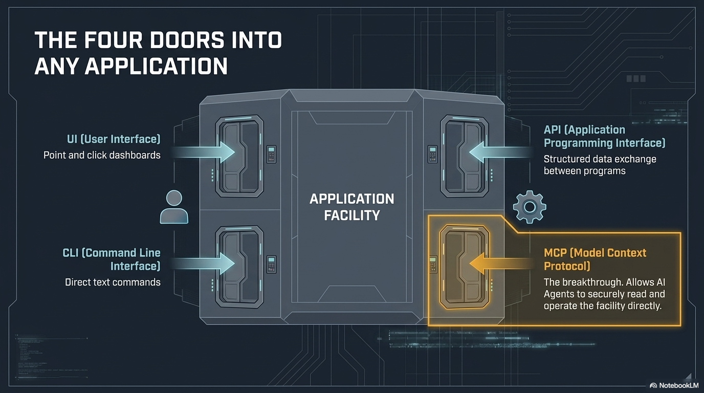
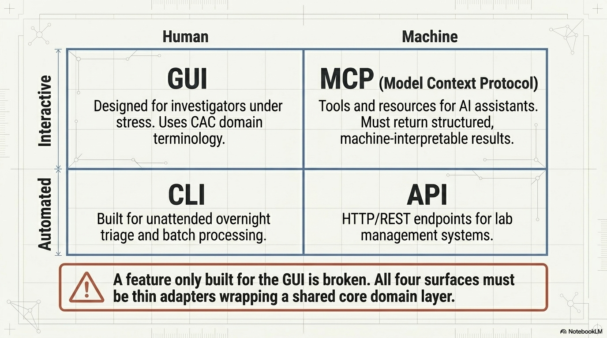

# The Four Doors Into Any Application

---

## Every Application Is a Building

It has multiple doors. Different users use different doors depending on their skill level and purpose.

```
┌──────────────────────────────────────────────────┐
│                YOUR APPLICATION                  │
│                                                  │
│   ┌──────┐   ┌──────┐   ┌──────┐   ┌──────┐    │
│   │  UI  │   │ CLI  │   │ API  │   │ MCP  │    │
│   │ Door │   │ Door │   │ Door │   │ Door │    │
│   └──┬───┘   └──┬───┘   └──┬───┘   └──┬───┘    │
└──────┼─────────┼─────────┼──────────┼───────────┘
       │         │         │          │
    ┌──┴──┐   ┌──┴──┐  ┌──┴───┐  ┌──┴───┐
    │Human│   │Power│  │ Apps │  │Agent │
    │User │   │User │  │      │  │      │
    └─────┘   └─────┘  └──────┘  └──────┘
```

---

## Instructor Visual: Four Doors



---

## Door 1: The UI (Front Door)

**Who uses it:** Everyone

The graphical interface — buttons, menus, forms, dashboards.

**Analogy:** The front door of a building. Lobby, signs, receptionist. Welcoming, but you can only go where the signs let you.

**You know this:** NCMEC CyberTipline portal, your case management system, Griffeye, any web application.

**Limitation:** Process 500 CyberTips? That's 500 clicks.

---

## Door 2: The CLI (Staff Entrance)

**Who uses it:** Power users, system administrators, technical investigators

A text-based interface — type commands, get results. No buttons.

**Analogy:** The staff entrance. No lobby. But you can go places the front door doesn't reach, and you can carry things in bulk.

**You may know this:** Terminal on your forensic workstation, running Autopsy from command line, using shell commands to search log files.

**Advantage:** Process 500 CyberTips? One command.

---

## Door 3: The API (Loading Dock)

**Who uses it:** Applications talking to other applications

A documented set of endpoints — structured requests and responses. One endpoint per query or action. The schema tells you what goes in and what comes back.

**Analogy:** The loading dock. No humans walk through it. Trucks pull up, exchange cargo in standardized containers. The manifest (schema) tells you what's inside.

**You already use this:** When your case management system pulls data from NCMEC automatically — that's an API call.

An application may have **many** API endpoints, each for a specific type of question or action.

---

## Door 4: MCP (The Agent's Door)

**Who uses it:** AI agents

Model Context Protocol — a standardized way for AI agents to discover and use an application's capabilities.

**Analogy:** A new door with a directory that says "here's everything you can do inside this building." The agent reads the directory and uses the right capability.

**Key insight:** MCP is to agents what APIs are to applications.

APIs let apps talk to apps. **MCP lets agents talk to apps.**

---

## The Superpower: Agents Use ALL Four Doors

| Door | Agent Capability |
|------|-----------------|
| UI | Multimodal agents can see screens, click buttons, fill forms |
| CLI | Agents type commands, read output, chain operations |
| API | Agents make structured requests, process responses |
| MCP | Purpose-built for agent interaction — the native door |

An AI agent isn't limited to one interface. It can use whichever door is most effective for the task at hand.

---

## The Game-Changer: Working ON and IN Simultaneously

**Working ON the application:**
The agent writes code, fixes bugs, adds features — it's a **developer**.

**Working IN the application:**
The agent queries data, generates reports, processes evidence — it's a **user**.

**Both at the same time:**
The agent builds a feature, tests it with real data, finds an issue, fixes it, re-tests — all in one continuous loop.

> The builder and the user are the same entity. This has never been possible before.

---

## Instructor Visual: Four-Surface Review



---

## What This Means for You

1. **You already use Door 1 (UI)** every day — every web app, every case management system
2. **Some of you use Door 2 (CLI)** for forensics — that's a superpower most investigators don't have
3. **Door 3 (API) is already at work** in your tools — you just didn't know it had a name
4. **Door 4 (MCP) is brand new** — it's why agentic AI is different from ChatGPT
5. **Working on AND in** is why you're here — you'll see this live in the lab
