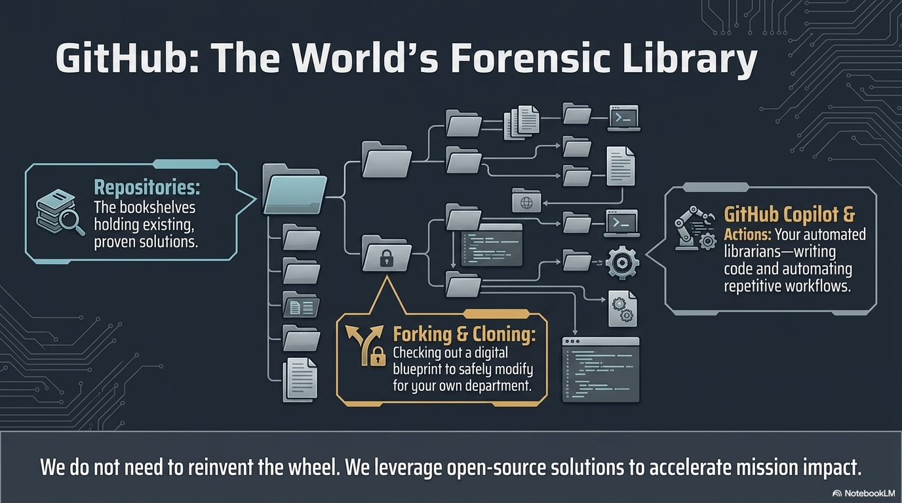

# GitHub as a Library & The Open-Source Mindset

---

## GitHub Is Not Just for Coders

GitHub is a **library** — the world's largest collection of software projects.

- Millions of projects, searchable and browsable
- Documentation, examples, and tutorials included
- Free to browse, free to use (with appropriate licensing)

You wouldn't write a report without checking if someone already covered the topic.

**Same principle applies to building tools.**

---

## Instructor Visual: GitHub as Library

---

## Before You Build, Search

Search GitHub for your problem domain:

- "ICAC investigation tool"
- "CyberTip processing"
- "digital forensics timeline"
- "CASE ontology example"
- "evidence chain of custody"

**Signals of quality:**
- Recent activity (commits, issues, releases)
- Stars (community approval)
- Clear README with documentation
- Active issue tracker
- A license file

---

## Key Organizations to Know

| Organization | What They Maintain |
|-------------|-------------------|
| [casework](https://github.com/casework) | CASE examples, tools, and documentation |
| [ucoProject](https://github.com/ucoProject) | UCO ontology core |
| [Cyber-Domain-Ontology](https://github.com/Cyber-Domain-Ontology) | CDO governance and shapes |
| [Project-VIC-International](https://github.com/Project-VIC-International) | CAC Ontology |

These are your starting points when building CAC mission tools.

---

## The Open-Source Mindset

### Don't Reinvent — Extend

If someone solved 80% of your problem, build on their work.

### Read the License

| License | What It Means |
|---------|--------------|
| Apache 2.0 | Use freely, modify, distribute. Include the license. |
| MIT | Use freely, almost no restrictions. |
| GPL | Use freely, but your modifications must also be open source. |

### Contribute Back

If you improve something, share it. The community gets stronger. The next investigator benefits from your work.

---

## The Principle for This Course

Every tool we build will follow this order:

1. **Search** — does something like this already exist?
2. **Evaluate** — can we use it, extend it, or learn from it?
3. **Build** — only build what's truly new
4. **Share** — contribute back to the community
