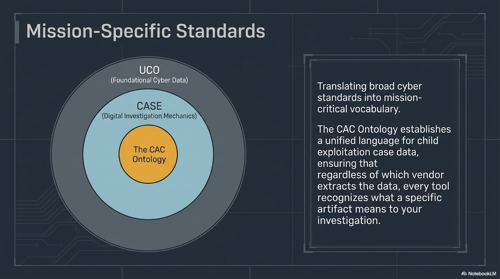

# The CAC Ontology

---

## What Is the CAC Ontology?

The **Crimes Against Children Ontology Family** — a domain-specific extension of UCO and CASE, built specifically for CAC/ICAC investigations.

- Shepherded by **Project VIC International**
- Open to all participants
- Part of the Linux Foundation **Cyber Domain Ontology** ecosystem
- Extends UCO, CASE, and gUFO (Unified Foundational Ontology)

**Website:** [site.cacontology.projectvic.org](https://site.cacontology.projectvic.org/)

---

## Instructor Visual: Mission-Specific Standards



---

## What It Models

```
┌─────────────────────────────────────────────────────┐
│                 CAC Ontology Domains                │
├──────────────────────┬──────────────────────────────┤
│ Core Framework       │ Investigations, lifecycles,  │
│                      │ CyberTip processing, NCMEC   │
├──────────────────────┼──────────────────────────────┤
│ Criminal Activities  │ CSAM production, grooming,   │
│                      │ sextortion, exploitation     │
├──────────────────────┼──────────────────────────────┤
│ Investigation        │ Undercover ops, physical     │
│                      │ evidence, multi-jurisdictional│
├──────────────────────┼──────────────────────────────┤
│ Technical Support    │ Digital forensics, content   │
│                      │ detection, platform analysis │
├──────────────────────┼──────────────────────────────┤
│ Victim Services      │ Impact assessment, recovery, │
│                      │ victim advocacy              │
├──────────────────────┼──────────────────────────────┤
│ Legal & Coordination │ Legal outcomes, sentencing,  │
│                      │ international cooperation    │
└──────────────────────┴──────────────────────────────┘
```

---

## By the Numbers

| Metric | Count |
|--------|-------|
| Specialized modules | 35+ |
| Classes (concepts) | 2,154 |
| Properties (descriptions & connections) | 2,443 |
| Ontology files | 97 |
| SHACL validation modules | 30 |
| Example knowledge graphs (real cases) | 56 |
| SPARQL analytics suites | 28 |
| Countries supported | 120+ |

This is **comprehensive**. It covers your mission and it continues to improve concept coverage over time.

---

## Walk Through: Modeling an Investigation

A CyberTip arrives → Investigation opens → Device seized → Evidence found → Arrest made

```
CyberTip-2024-001
    │
    ├── triggers ──► Investigation-CAC-001
    │                    │
    │                    ├── seizes ──► Device-Phone-A
    │                    │                 │
    │                    │                 ├── contains ──► Evidence-Image-X
    │                    │                 │                   │
    │                    │                 │                   ├── hasHash ──► "a1b2c3..."
    │                    │                 │                   └── classifiedAs ──► "Category A"
    │                    │                 │
    │                    │                 └── analyzedBy ──► ForensicAction-001
    │                    │                                       │
    │                    │                                       ├── usedTool ──► Griffeye
    │                    │                                       └── performedBy ──► Examiner-Jones
    │                    │
    │                    ├── hasSubject ──► Suspect-B
    │                    │                    │
    │                    │                    └── hasAccount ──► OnlineAccount-C
    │                    │
    │                    └── resultsIn ──► Arrest-001
    │                                        │
    │                                        └── leadsTo ──► Prosecution-001
    │
    └── reportedBy ──► NCMEC
```

**Every node is a CAC Ontology class. Every edge is a property. The entire investigation is a queryable, shareable, machine-readable graph.**

---

## The AI-Assisted Modeling Workflow

You don't need to write this graph by hand.

1. **Start with a document** — a press release, a report, a tool export
2. **Give it to an AI agent** with the CAC Ontology context and access to the CASE/UCO SDK
3. **The agent reads the ontology**, identifies the relevant concepts
4. **The agent produces the graph** in Turtle or JSON-LD format
5. **You review and refine**
6. **SHACL validation** checks the grammar and business rules

**Guide:** [Model Documents with AI](https://site.cacontology.projectvic.org/developers/ai-modeling)

---

## The Democratization Moment

### You no longer need to be a software developer.

| Old Way | New Way |
|---------|---------|
| Hire a developer | Describe what you need to an agent |
| Learn RDF/JSON-LD/SPARQL | The agent handles the syntax |
| Read 97 ontology files | The agent reads them for you |
| Write serialization code | Use the CASE/UCO/CAC SDK |
| Wait months for a tool | Prototype in hours |

---

## Use Multiple AI Models as Your Review Team

Generate with one model. Review with another. Validate with SHACL.

- **Model A** generates the knowledge graph from your document
- **Model B** reviews it — "Did you miss the victim services? Is the chain of custody complete?"
- **SHACL validation** checks structural correctness against business rules
- **You** make the final call

Different models catch different things. Use them like you'd use peer reviewers.

---

## International Reach

CAC Ontology supports coordination across **120+ countries** based on concept adoption from the International Centre for Missing and Exploited Children.

- International legal harmonization
- Cross-border operation frameworks
- Multilingual concept support
- Shared vocabulary across agencies worldwide

When you build on CAC Ontology, your data doesn't stop at your border.
