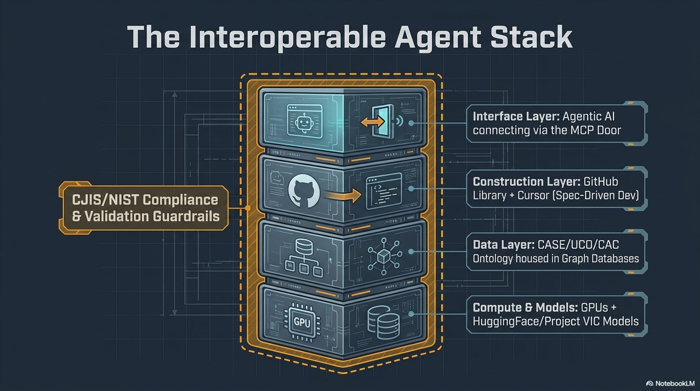
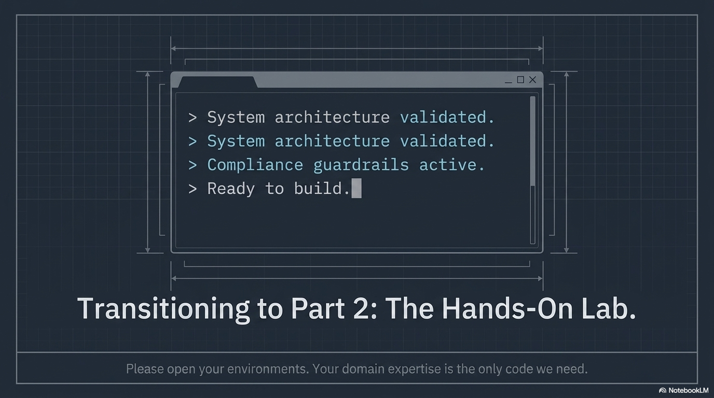

# Bridge to Lab

---

## What You've Learned

You've gone from:

| From | To |
|------|-----|
| "What is AI?" | Understanding models, agents, GPUs, and how they work together |
| "GitHub is for coders" | GitHub is a library — search before you build |
| "I can't build tools" | Spec-driven development lets anyone direct an AI agent |
| "My tools don't talk to each other" | CASE/UCO/CAC + graph databases = full interoperability |
| "I need a developer" | You + an agent + the SDK is enough |
| "What about security?" | CJIS, NIST 800-53, encryption — baked into the constitution |
| "Can I trust it?" | Independent T&V before any operational use |

---

## Instructor Visual: Interoperable Agent Stack

---

## What You're About to Do

In the lab, you will:

1. **Set up your environment** — Cursor, GitHub, Python
2. **Explore GitHub** — find existing CAC/ICAC projects and models
3. **Talk to an AI agent** — your first conversation in Cursor
4. **Define a tool with spec-driven development** — constitution (with CJIS/NIST/T&V), spec, plan, tasks
5. **See CASE/UCO in action** — examine and modify real knowledge graphs
6. **Model an investigation with CAC Ontology** — using the AI-assisted workflow
7. **Build a prototype** — watch an agent build a real, interoperable, security-aware tool

---

## Instructor Visual: Transition to Part 2

---

## What to Bring to the Lab

Think about:

- A **tool you've wished existed** — a gap in your workflow
- A **report you wish was automated** — something you generate manually
- A **data connection you wish you could make** — two systems that should talk
- A **question you wish you could query** across all your case data

**Bring that idea. We're going to build it.**

---

## The Agent Works for You

Point your agent at:
- **This repository** — it inherits all the course context and standards
- **The CJIS Security Policy** — it generates compliance checklists
- **NIST 800-53** — it audits your application against security controls
- **The CAC Ontology** — it models your investigation data

All you have to do is **describe what you need** and **point the agent at the right standards**.

---

## Instructor Visual: Course Map Revisited

---

## The Bottom Line

> If you can write an email, you can write a specification.
>
> If you can write a specification, the AI can help you build the tool.
>
> If you build the tool on CASE/UCO/CAC, it's interoperable from day one.
>
> If you put CJIS and NIST in the constitution, security is built in from the start.
>
> And before it goes operational — independent testing and validation. Always.

**The future isn't coming. It's here. Let's go build.**
