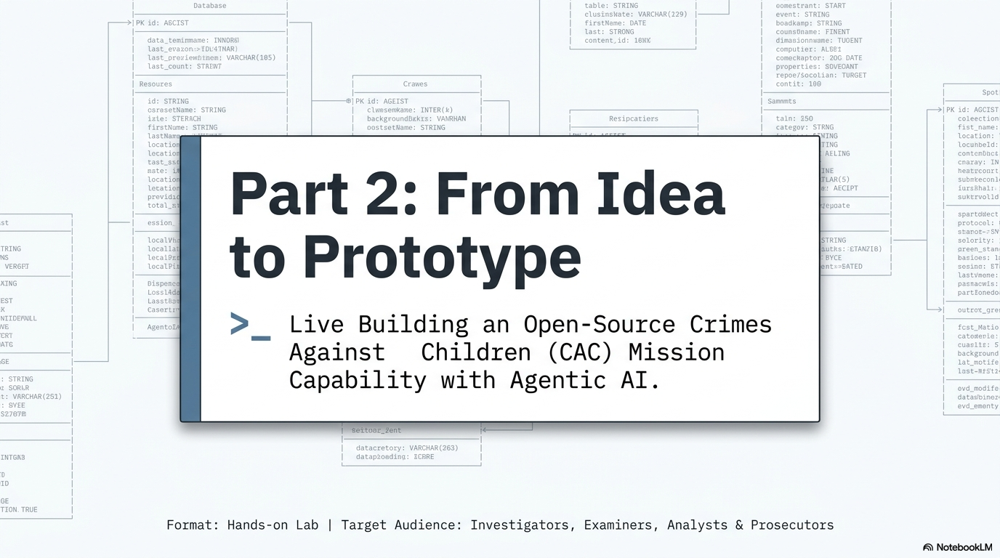
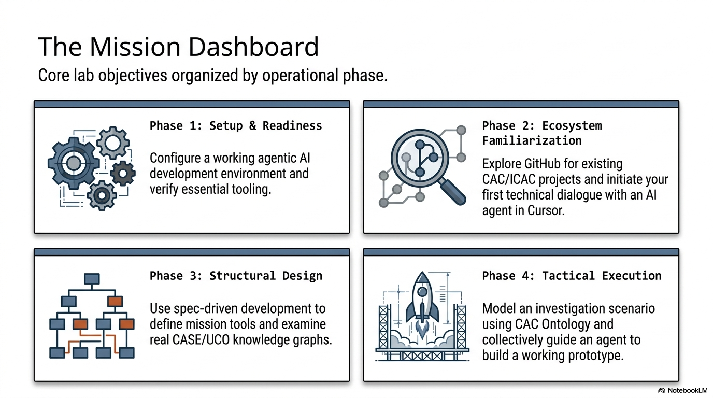
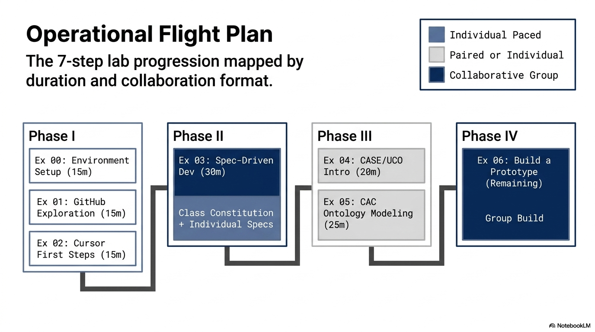
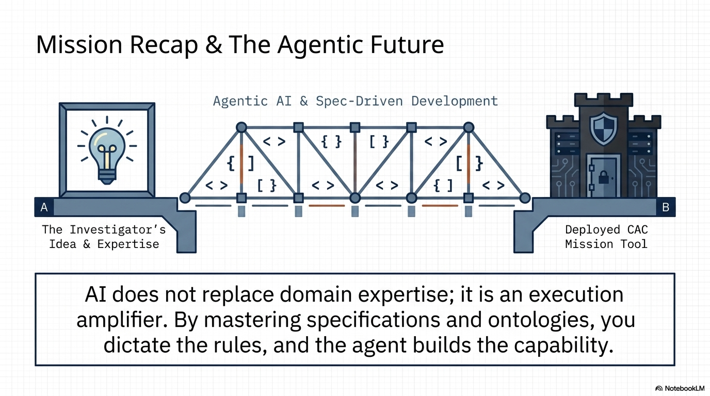

# Part 2: From Idea to Prototype

## Live Building an Open-Source Crimes Against Children Mission Capability with Agentic AI

**Format:** Hands-on lab
**Audience:** Law enforcement investigators, forensic examiners, crime intelligence analysts, and prosecutors working CAC/ICAC cases
**Prerequisites:** [Setup checklist](prerequisites.md) — laptop, GitHub account, Cursor installed, Python 3.10+

## Start Here

This lab uses two repositories with different jobs:

- The course repository explains the method and provides the exercise sequence.
- The [Project VIC Agentic AI Development Project Template](https://github.com/Project-VIC-International/Agentic-AI-Development-Project-Template) is the working repository each student should build in.

Before Exercise 0, create or open your private template-based project repository. Then use this lab guide as the reference while doing the work in your own repository.

Use [course-template-crosswalk.md](course-template-crosswalk.md) to see how each lab exercise maps into the template.

## Instructor Visuals

Use these visuals to orient the room before the hands-on work begins:

## Lab Goals

By the end of this lab, you will have:

1. Set up a working agentic AI development environment
2. Explored GitHub to find existing CAC/ICAC projects
3. Had your first conversation with an AI agent in Cursor
4. Used spec-driven development to define a mission tool
5. Examined and modified real CASE/UCO knowledge graphs
6. Modeled an investigation scenario using CAC Ontology with AI
7. Watched (and guided) an agent building a working prototype

## Exercises

| # | Exercise | Duration | Description |
|---|----------|----------|-------------|
| 00 | [Environment Setup](exercises/00-environment-setup/) | 15 min | Verify tools, create/open your private template repo, orient to the IDE |
| 01 | [GitHub Exploration](exercises/01-github-exploration/) | 15 min | Search for projects, explore key organizations |
| 02 | [Cursor First Steps](exercises/02-cursor-first-steps/) | 15 min | First agent conversation, explain code, create a script |
| 03 | [Spec-Driven Development](exercises/03-spec-driven-dev/) | 30 min | Constitution, specify, plan, tasks with spec-kit |
| 04 | [CASE/UCO Introduction](exercises/04-case-uco-introduction/) | 20 min | Examine, understand, and modify CASE graphs |
| 05 | [CAC Ontology Modeling](exercises/05-cac-ontology-modeling/) | 25 min | Model an investigation with AI-assisted workflow |
| 06 | [Build a Prototype](exercises/06-build-a-prototype/) | Remaining | End-to-end build of an interoperable CAC tool |

## Facilitator Notes

### Before the Lab

1. Ensure the room has reliable internet access — students will need GitHub and Cursor
2. Have the [prerequisites checklist](prerequisites.md) sent to students in advance
3. Pre-test the exercises on a clean machine with the same setup students will have
4. Have a backup plan for students who couldn't complete prerequisites (pair them with someone who did)

### During the Lab

- **Exercises 0-2** are individual — each student works at their own pace
- **Exercise 3** is collaborative — the class writes the constitution together, then individuals specify
- **Exercises 4-5** can be individual or paired
- **Exercise 6** is a group activity — the class collectively guides the build
- The course repo can stay open in a browser tab while each student works from their own template-based repository in Cursor

### Pacing

- Don't rush the early exercises. If students are struggling with setup or Cursor basics, spend more time there. A student who is comfortable with the agent will get more out of exercises 3-6.
- Exercise 6 is intentionally open-ended. Use whatever time remains.

### Common Issues

- **Cursor free tier limits:** Students may hit rate limits. Have them pair up if this happens.
- **Python version issues:** Ensure Python 3.10+ is installed. The `python3 --version` command should confirm.
- **Git authentication:** Students may need to authenticate Git with GitHub. `gh auth login` or SSH key setup may be needed.
- **Local setup problems:** Fall back to GitHub Codespaces, pair with a working student, or have the student complete only the intake and prompt steps while following along.

## Closing Visual

Use this recap when transitioning from the live prototype back to what participants can do after the course:

