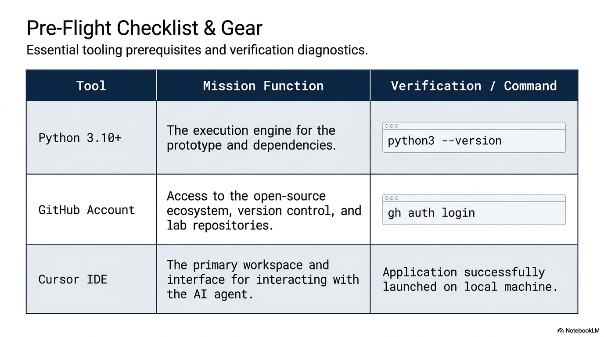

# Exercise 0: Environment Setup

**Duration:** 15 minutes
**Goal:** Verify your development environment is working, create or open your template-based project, and get oriented in Cursor

> **Observer mode?** If you're following along without a full install, skip to [Step 3](#step-3-open-in-cursor) and follow on the projector. You can still browse the [course repository on GitHub](https://github.com/Project-VIC-International/Agentic-AI-Development-Course) in your browser. Pair with a neighbor for the hands-on steps.

## Instructor Visual



## Step 1: Verify Your Tools

Open a terminal (Command Prompt on Windows, Terminal on Mac/Linux) and run:

```bash
git --version
python3 --version
```

> **Windows users:** If `python3` is not recognized, try `python --version` instead. Either is fine as long as the version is 3.10+.

You should see version numbers for both. If not, see the [prerequisites guide](../../prerequisites.md).

## Step 2: Create Your Private Lab Workspace

For the lab, your working repository should be a private repository created from the Project VIC template.

Recommended with GitHub CLI:

```bash
gh repo create my-agentic-ai-project \
  --template Project-VIC-International/Agentic-AI-Development-Project-Template \
  --private \
  --clone
cd my-agentic-ai-project
```

If you prefer the GitHub website, create a new private repository from the template there, then clone your new repository locally.

If you want to run the optional course preflight check, clone the course repository separately:

```bash
git clone https://github.com/Project-VIC-International/Agentic-AI-Development-Course.git
cd Agentic-AI-Development-Course
```

Run the preflight check to verify everything at once:

```bash
python3 part-2-lab/preflight.py
```

> **Windows users:** Use `python part-2-lab/preflight.py` if `python3` is not recognized.

The script checks all required and optional dependencies. Fix any `FAIL` items. `WARN` items are optional and won't block you.

## Step 3: Open in Cursor

Launch Cursor and open your private template-based project folder:

- **Option A:** In the terminal, change into your private project folder and type `cursor .` (if Cursor is in your PATH)
- **Option B:** Open Cursor → File → Open Folder → select the folder

## Step 4: Orient Yourself in Cursor

Take a minute to explore the interface:

1. **File Explorer (left panel):** Shows your project files. Click on any file to open it.
2. **Editor (center):** Where files are displayed and edited.
3. **Terminal (bottom):** Click Terminal → New Terminal. This is where you run commands.
4. **Agent Panel (right or via Cmd/Ctrl+L):** This is where you chat with the AI agent.

Try opening the agent panel now. You should see a text input where you can type messages.

## Step 5: Your First Agent Interaction

In the agent panel, type:

> Read START-HERE-NCCC.md and QUICKSTART.md in this project. Explain the student workflow and tell me what I should do before asking you to build anything.

The agent will read the project files and explain what it finds. This is your first taste of working with an AI agent — you ask in natural language, it explores and answers.

## Step 6: Verify Python Environment

In the Cursor terminal, run:

```bash
python3 -c "print('Environment is ready!')"
```

> **Windows users:** Use `python -c "print('Environment is ready!')"` if `python3` is not recognized.

You should see `Environment is ready!` printed.

## Done When

Before moving on, confirm:

- [ ] Git is installed and working
- [ ] Python 3.10+ is installed and working
- [ ] Preflight check passes (no `FAIL` items)
- [ ] Your private template-based repository exists
- [ ] Cursor is open with your private project loaded
- [ ] You've opened the agent panel and sent a message
- [ ] The terminal works inside Cursor

**Observer mode:** Confirm you can see the instructor's screen and you have the [GitHub repo](https://github.com/Project-VIC-International/Agentic-AI-Development-Course) open in your browser.

If any of these aren't working, ask the instructor for help now — everything that follows depends on this setup.

## What You Just Did

You set up a complete agentic AI development environment. You have:

- **Git** — for version control and collaboration
- **Python** — for running and building tools
- **Cursor** — an IDE with an AI agent that can read files, write code, and run commands
- **The course repository** — the exercise guide and reference material
- **Your private template repository** — the workspace where you will actually build

You also had your first interaction with an AI agent. It read your project files and answered your question in natural language. That's the foundation everything else builds on.
