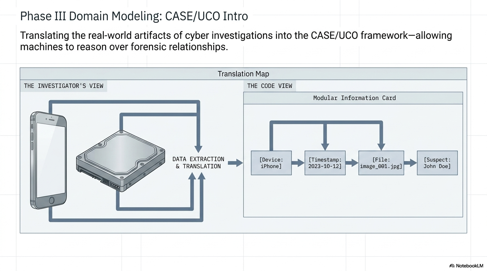

# Exercise 4: CASE/UCO Introduction

**Duration:** 20 minutes
**Goal:** Understand CASE and UCO by examining, querying, and modifying real knowledge graphs

## Instructor Visual



## What You'll Do

You'll work with actual CASE/UCO data — the same format that interoperable tools produce. By the end, you'll be able to read a knowledge graph and understand what it represents.

## Step 1: Examine a CASE Graph

Open the example file:

```
part-2-lab/exercises/04-case-uco-introduction/examples/simple-investigation.jsonld
```

This is a JSON-LD file representing a simple investigation. Don't worry if the syntax looks unfamiliar — ask the agent to explain it.

In the agent panel:

> Read the file part-2-lab/exercises/04-case-uco-introduction/examples/simple-investigation.jsonld and explain what it represents in plain language. What investigation does it describe? What evidence was found? What tools were used?

Watch how the agent translates the structured data into a narrative you can understand.

## Step 2: Understand the Building Blocks

Ask the agent:

> In the CASE graph we just looked at, explain these concepts:
> 1. What is a namespace (the @context section)?
> 2. What is a class (like uco-observable:Device)?
> 3. What is a property (like uco-core:name)?
> 4. What is a relationship (like uco-observable:contains)?
> 5. What is a Facet in UCO?
>
> Use examples from the file to illustrate each concept.

**Key concepts to understand:**
- **Namespace:** A topic-specific vocabulary — `uco-observable:` is the namespace for things you can observe (devices, files, accounts)
- **Class:** A type of thing — `uco-observable:Device` is a class representing any device
- **Property:** A description of a thing — `uco-core:name` gives something a name
- **Relationship:** A connection between things — a device "contains" a file
- **Facet:** A set of related properties grouped together — a file has a `ContentDataFacet` with its hash, size, etc.

## Step 3: Compare Formats

The same investigation is also represented in Turtle format:

```
part-2-lab/exercises/04-case-uco-introduction/examples/simple-investigation.ttl
```

Ask the agent:

> Compare the JSON-LD and Turtle versions of the same investigation. How are they different in syntax? What's the same about the information they represent?

**Key insight:** JSON-LD and Turtle are two different ways to write the same data. They contain identical information — just different syntax. This is like the same story written in English and Spanish.

## Step 4: Modify the Graph

Now try making a change. Ask the agent:

> Add a second device to the investigation in the JSON-LD file — a laptop computer (Dell Latitude) that was also seized during the search warrant. It contains a file called "chat_logs.txt" that was extracted by the examiner using Autopsy. Make sure it follows the same patterns as the existing device.

Watch how the agent:
1. Reads the existing structure
2. Understands the patterns
3. Adds new data that follows the same conventions
4. Maintains CASE/UCO compliance

## Step 5: Understand Why This Matters

Ask the agent:

> If I had this investigation data as a CSV export from my forensic tool instead of a CASE graph, what information would I lose? What can I do with the CASE graph that I can't do with a CSV?

The answer illustrates the core value proposition:
- **CSV:** flat rows and columns, no relationships, no provenance
- **CASE graph:** connected data with full context — who found what, when, how, connected to whom

## Step 6: Validate with SHACL

Now see validation in action. In the Cursor terminal, install the dependencies (if you haven't already) and run the validator:

```bash
pip install rdflib pyshacl
```

Validate the known-good graph:

```bash
python3 part-2-lab/exercises/04-case-uco-introduction/validation/validate_graph.py
```

You should see `PASS`. Now validate the graph with intentional errors:

```bash
python3 part-2-lab/exercises/04-case-uco-introduction/validation/validate_graph.py part-2-lab/exercises/04-case-uco-introduction/validation/graph_with_errors.jsonld
```

You should see `FAIL` with specific error messages — a missing name on the investigation, a file with no facets, an action with no performer.

**This is SHACL in action.** The shapes file (`investigation-shapes.ttl`) defines the grammar rules. The validator checks your data against those rules. If two tools both validate against the same shapes, their outputs are guaranteed to be compatible.

> **Windows users:** Use `python` instead of `python3` if needed.

## Done When

- [ ] You read the JSON-LD investigation graph and can explain what it represents
- [ ] You can name the five building blocks: namespace, class, property, relationship, facet
- [ ] You compared JSON-LD and Turtle formats
- [ ] You added a second device to the JSON-LD graph (agent-assisted)
- [ ] You ran the validator on the good graph and saw `PASS`
- [ ] You ran the validator on the bad graph and saw `FAIL` with specific errors
- [ ] You can articulate why a knowledge graph is more powerful than a CSV export

**Artifacts:** A modified `simple-investigation.jsonld` with the added laptop device, and a successful validation run.

## What You Just Did

You worked directly with CASE/UCO data:

1. **Read** a knowledge graph and understood what it represents
2. **Learned** the building blocks: namespaces, classes, properties, relationships, facets
3. **Compared** two serialization formats (JSON-LD and Turtle)
4. **Modified** a graph by adding new evidence — with the agent handling the syntax
5. **Understood** why structured, standards-based data is more powerful than flat exports

This is the data format that makes interoperability possible. Every tool that reads and writes CASE data can exchange information with every other CASE-aware tool — no manual normalization required.
